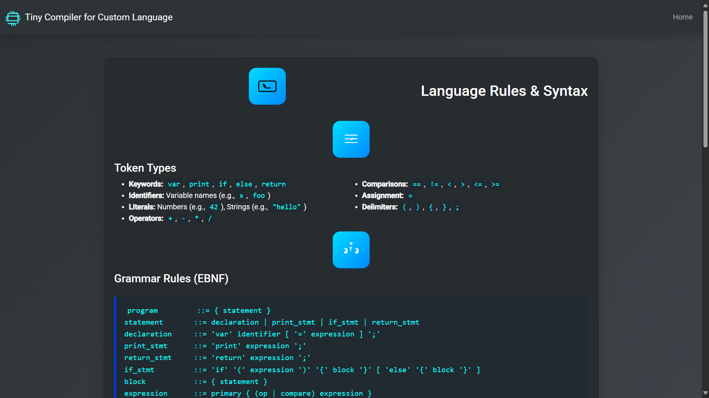

# Tiny Compiler for Custom Language

A modern, interactive web-based compiler interface for a custom programming language. This project provides a user-friendly platform to write, analyze, and optimize code in your custom language, featuring a beautiful UI and real-time feedback.

## Features

- **Modern UI**: Responsive, visually appealing interface built with Bootstrap 5 and SVG icons.
- **Code Editor**: Large, comfortable code input area with syntax highlighting colors.
- **Compilation Pipeline**: Tokenization, parsing, semantic analysis, intermediate code, assembly code, and code optimization at the click of a button.
- **Real-Time Output**: See compilation results and optimizations instantly.
- **Language Rules**: Dedicated page summarizing the grammar, syntax, and features of the custom language.
- **No Image Dependencies**: All visuals use SVGs and gradients for fast loading and a clean look.

## Getting Started

### Prerequisites
- Python 3.7+
- Flask (`pip install flask`)
- A C++ compiler (for the backend compiler, if you want to rebuild `compiler.exe`)

### Installation
1. **Clone the repository**
   ```bash
   git clone <your-repo-url>
   cd Compiler
   ```
2. **Install dependencies**
   ```bash
   pip install flask
   ```
3. **Ensure the C++ compiler backend is built**
   - If you have `compiler.exe` already, you can skip this step.
   - Otherwise, build it from `compiler.cpp`:
     ```bash
     g++ compiler.cpp -o compiler.exe
     ```

### Running the Web App
1. **Start the Flask server**
   ```bash
   python app.py
   ```
2. **Open your browser and go to**
   ```
   http://127.0.0.1:5000/
   ```
3. **Write code in the editor, select an action, and see results instantly!**

## Project Structure
```
Compiler/
  app.py                # Flask backend
  compiler.cpp          # C++ source for the custom language compiler
  compiler.exe          # Compiled backend (Windows)
  input.mini            # Sample input file
  templates/
    index.html          # Main web interface
    rulesection.html    # Language rules and syntax page
```

## Screenshots

- **Main Interface:**
  
- **Language Rules Page:**
  

## Custom Language
- See the **Language Rules & Syntax** page in the app for grammar, tokens, and sample programs.

---
Feel free to customize and extend this project for your own language or educational use!
